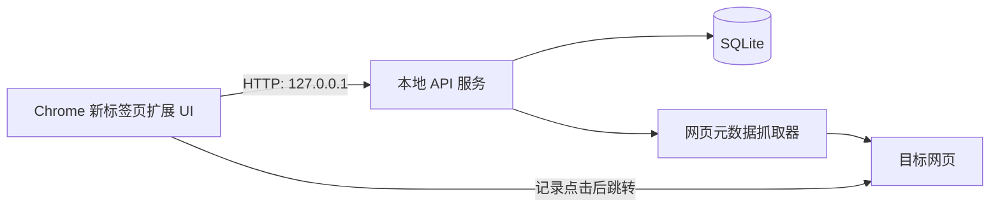

# 本地 Chrome 新标签页书签管理插件：实施计划

## 1. 需求摘要

构建一个仅供本人本机使用的 Chrome Manifest V3 插件，作为新的快速访问页：

- **从零开始建库**：不导入、不回写 Chrome 原生书签。
- 通过 `chrome_url_overrides.newtab` 覆盖新标签页；这是扩展可稳定接管的浏览器入口。Chrome 的启动页和主页按钮不由扩展直接强制替换，使用说明中应指引用户把新标签页作为日常入口。
- 所有业务数据由本机后端持久化管理；扩展不以 `chrome.storage` 作为书签数据源，仅可保存“最近一次后端地址”等连接偏好。
- 支持标签页（分类）和链接的增删改排、拖拽排序；链接支持标题、简介、URL、favicon、显示名及外观覆盖。
- 添加链接时后端抓取网页 title、description、favicon；失败仍创建可编辑的 URL 条目。
- 支持文字卡片与列表两种展示模式；默认文字卡片（标题 + 简介 + favicon），不做网页截图或缩略图。
- 每次从主页打开链接时先写入点击事件，再跳转；主页显示累计点击数及最近访问时间。

## 2. 范围与非目标

### 首版包含

- 本地单用户、无登录、无云同步。
- 标签页、链接、设置、访问统计四个主要界面/交互面。
- 响应式新标签页，键盘可操作的新增、编辑、删除和排序入口。
- 失败可恢复的元数据抓取，以及服务未启动时的明确离线提示。

### 首版不包含

- Chrome 原生书签双向同步或导入。
- 多账户、协作、跨设备同步。
- 页面截图、缩略图、网页内容存档。
- 云端代理抓取、登录网站数据抓取或绕过反爬。
- 复杂分析报表；仅提供单链接累计次数和最近访问时间。

## 3. 架构决策

采用 TypeScript monorepo：`apps/extension` 使用 React + Vite + Manifest V3；`apps/server` 使用 Fastify；SQLite 由服务端独占；共享的 Zod schema 和 TypeScript 类型放在 `packages/contracts`。这样既保持扩展轻量，又让未来可能的桌面管理器或命令行工具复用同一 API，不会把核心数据锁在浏览器扩展存储里。

服务默认绑定 `127.0.0.1`，使用随机生成的本机 bearer token 鉴别扩展请求。令牌在首次配对时写入扩展本地存储，服务端仅接受 loopback 请求。该 token 不是多用户登录，而是防止本机其他网页对本地 API 进行未授权写入。

## 4. 数据模型

### `folders`

| 字段 | 用途 |
| --- | --- |
| `id` (UUID) | 稳定资源标识 |
| `name` | 用户可修改的标签名 |
| `position` (REAL) | 拖拽排序键，支持两项之间插入 |
| `created_at`, `updated_at` | 审计与同步 UI |

### `links`

| 字段 | 用途 |
| --- | --- |
| `id` (UUID), `folder_id` | 链接及其所属标签 |
| `url` | 规范化后的目标 URL |
| `title`, `description`, `favicon_url` | 自动抓取结果，可被编辑 |
| `display_name` | 可空；有值优先于 `title` 展示 |
| `metadata_status`, `metadata_error`, `metadata_fetched_at` | `pending/succeeded/failed` 及可诊断状态 |
| `position` (REAL) | 同一标签内排序键 |
| `appearance_override_json` | 仅存用户确实设置的单链接显示覆盖 |
| `created_at`, `updated_at` | 维护信息 |

### `click_events`

| 字段 | 用途 |
| --- | --- |
| `id` (UUID), `link_id` | 点击事件归属 |
| `clicked_at` | 点击发生时间（UTC） |

为 `click_events(link_id, clicked_at DESC)` 建索引。主页读取时通过聚合查询得到 `click_count` 与 `last_clicked_at`，避免把可推导计数写回链接表导致并发不一致。

### `settings`

单行 JSON 配置，至少包含：主题（跟随系统/浅色/深色）、布局（grid/list）、列数、卡片间距、卡片宽度、居中、是否显示新增按钮、紧凑布局、字体族、文字颜色、强调色，以及标题/简介/计数/最近访问的显示开关。

## 5. 接口契约

在 `packages/contracts/src/api.ts` 以 Zod 定义请求、响应和错误码；服务和扩展均直接引用。

| 方法 | 路径 | 职责 |
| --- | --- | --- |
| `GET` | `/health` | 服务可用性与协议版本 |
| `GET/PUT` | `/api/settings` | 读取、更新全局展示设置 |
| `GET/POST` | `/api/folders` | 列表、创建标签 |
| `PATCH/DELETE` | `/api/folders/:id` | 改名、删除标签 |
| `POST` | `/api/folders/reorder` | 原子更新标签顺序 |
| `GET/POST` | `/api/folders/:folderId/links` | 获取/创建该标签内链接 |
| `PATCH/DELETE` | `/api/links/:id` | 编辑、删除链接 |
| `POST` | `/api/links/reorder` | 原子更新链接顺序/跨标签移动 |
| `POST` | `/api/links/:id/refresh-metadata` | 重试抓取元数据 |
| `POST` | `/api/links/:id/clicks` | 记录点击并返回确认 |

删除标签时前端必须先显示其链接数。确认后，服务在一个事务内删除标签及其链接；相关点击事件以外键级联清理。不要以“最新标签/链接”推断操作对象，所有变更均按资源 ID 发起。

## 6. 实施步骤

1. 初始化 pnpm workspace、TypeScript 严格配置、ESLint、Vitest 与 Playwright；建立 `apps/extension`、`apps/server`、`packages/contracts` 和根目录启动脚本。
2. 实现 SQLite migration、repository 和事务边界：外键、排序键索引、点击聚合查询、初始默认设置；补齐 repository 单元测试。
3. 建立 Fastify API：loopback 绑定、扩展来源 CORS 白名单、token 鉴别、Zod 验证、统一错误体、`/health`。实现 folder/link/settings/click 的完整 CRUD 与排序 API。
4. 实现元数据抓取器：只允许 `http/https`；设置连接/响应大小/总超时；有限重定向；解析 HTML 的 `<title>`、`meta[name=description]`、Open Graph title/description 和 favicon link；抓取失败记录状态但不阻断创建。对私网、loopback、link-local 地址做 SSRF 拦截，且不抓取文件 URL。
5. 搭建 MV3 扩展：`manifest.json` 声明 `chrome_url_overrides.newtab`、必要 host permissions（仅本机 API），`newtab.html` 加载 React 应用；设置页说明服务启动、连接状态与新标签页边界。
6. 开发主页：标签栏 + 添加/编辑入口；按设置渲染 grid/list；卡片仅用 favicon 和文字；无 favicon 时生成稳定的文字首字母图标；展示点击次数与最近访问时间。遵从系统深浅色并提供截图所示的紧凑、密度和布局控制。
7. 加入拖拽：使用键盘可访问的 dnd 方案，支持标签重排、链接同标签重排和跨标签移动；前端乐观更新，失败时回滚并提示。拖拽结束只提交一条原子排序请求。
8. 开发链接编辑抽屉/弹窗：粘贴 URL 后自动创建并显示抓取进度；允许覆盖显示名、标题、简介、图标 URL；提供“重新抓取”及失败原因。
9. 实现访问追踪：点击时先 `POST /clicks`，以短超时等待；成功后用 `chrome.tabs.update` 或普通链接导航打开目标。若服务短暂不可用，仍允许打开链接，同时将事件入扩展内存队列并在恢复后补发；关闭新标签页前未送达的事件不承诺保存。
10. 提供本地运行、打包、加载未封装扩展、数据目录备份与恢复的 README；为服务地址/token 提供显式“重新配对”操作。

## 7. 可测试验收标准

1. 加载扩展后，新建标签页显示主页；应用不请求网页缩略图，也不包含截图采集权限。
2. 在空库中可创建、重命名、删除 3 个以上标签；删除前显示影响数量，确认后其链接不可再通过 API 获取。
3. 一个标签中可创建、编辑、删除至少 10 个链接；修改显示名后主页优先显示它而不是抓取标题。
4. 将一个标签和一个链接各拖至至少两个不同位置；刷新主页后顺序保持；跨标签拖动后链接仅出现一次。
5. 对可公开访问网页，创建链接后 15 秒内显示抓取到的 title 或明确的失败状态；手动改写标题、简介和 favicon 后刷新不丢失。
6. 选择 grid/list、浅/深/跟随系统，修改列数、间距、宽度、居中、紧凑和显示字段后，刷新新标签页设置仍生效。
7. 同一链接点击 3 次，API 聚合数和主页显示均为 3，且最近访问时间不早于最后一次点击；服务重启后统计仍存在。
8. 服务停止时主页在 2 秒内显示可执行的连接错误，不误称数据为空；已渲染的链接仍可点击打开。
9. 非法 URL、私网 IP、超大 HTML、超时和非 HTML 响应均不会造成服务崩溃或内网请求；对应链接仍可由用户手动编辑。
10. `pnpm lint`、`pnpm typecheck`、单元测试、API 集成测试、扩展端 Playwright 关键流程均通过，且 `git diff --check` 无输出。

## 8. 风险与缓解

| 风险 | 缓解 |
| --- | --- |
| “替代主页”被理解为修改 Chrome 启动页 | 产品文案明确为“新标签页快速访问”；设置页给出 Chrome 启动配置说明，不宣称强制接管主页按钮。 |
| 本地 API 被恶意网页调用 | 仅 loopback 监听、token 鉴别、严格 CORS/Origin、扩展最小权限。 |
| 元数据抓取引发 SSRF 或卡住 UI | 服务端地址校验、DNS/IP 复核、超时/体积上限、异步状态与失败可见。 |
| 拖拽排序高频写入导致错序 | 以 item ID 和目标上下文提交一次原子事务；采用分数 position，必要时在服务端压缩排序键。 |
| 后端未启动使新标签页失效 | 首屏区分“连接失败”和“空状态”，保留最后成功快照为只读缓存，提供启动与重连说明。 |

## 9. 验证路径

1. 以临时数据目录启动服务，跑 migration/repository/API 集成测试。
2. 构建扩展，在 `chrome://extensions` 载入未封装版本，打开新标签页完成 CRUD、拖拽、主题和刷新持久化的 Playwright/人工验证。
3. 用受控 HTTP fixture 覆盖成功、无 title、超时、重定向、私网 URL 和 favicon 缺失的抓取场景。
4. 用数据库断言和 UI 断言验证点击事件的时间、次数及重启后持久性。
5. 停止服务并验证 2 秒内错误态、既有卡片可打开；随后重启服务并验证自动重连和缓存更新。

## 10. ADR：后端所有权与本地边界

**Decision**：采用本机 Fastify + SQLite 后端作为全部书签、设置和统计的权威数据源，MV3 新标签页扩展只负责交互和请求转发。

**Drivers**：用户明确要求后端存储；单机使用应保留低运维与离线能力；未来可脱离扩展复用 API。

**Alternatives considered**：

- 仅用 `chrome.storage`：部署最少，但与“数据都保存到后端”冲突，且日后迁移和外部管理能力受限。
- 云端 API：可为同步铺路，但引入账户、运维、隐私和网络依赖，与单机首版不匹配。

**Why chosen**：本地后端满足独立存储、可扩展 API 和隐私边界，同时不把不需要的账号系统提前带入产品。

**Consequences**：用户需要启动本地服务；扩展需要管理连接异常与本地配对 token；元数据抓取安全由后端负责。

**Follow-ups**：实际使用后再评估定时备份、导入 Chrome 书签和可选同步，不预置多账户数据结构。
